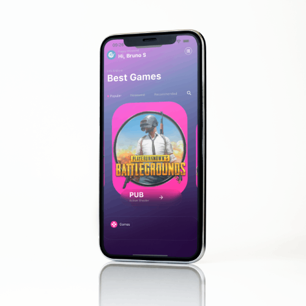

<h1 align="center">Best Games - Flutter Project</h1>

 

## Description

Welcome to the Best Games Flutter project! This repository showcases a beautifully designed app that highlights a collection of popular games using a captivating slider layout. With stunning visuals and intuitive navigation, Best Games provides an immersive experience for gamers and app enthusiasts alike.

<h4>Features</h4>
- Sleek Design: Best Games features an elegant and modern user interface, making it visually appealing to users.
- Interactive Slider: The app utilizes the carousel_slider package to display a dynamic and interactive slider that showcases various game images.
- Glassmorphism: Incorporating the glass_kit package, the app employs the glassmorphism design trend, enhancing the aesthetics and adding a touch of sophistication.
- Smooth Navigation: Users can seamlessly glide through the slider and access more information about each game.

<h4>Dependencies</h4>
The following dependencies were used to develop the Best Games project:

- [glass_kit](https://pub.dev/packages/glass_kit): This package enables the implementation of the glassmorphism design style, providing a modern and translucent look to UI elements.
- [carousel_slider](https://pub.dev/packages/carousel_slider): The carousel slider package facilitates the creation of an interactive slider that allows users to swipe through game images effortlessly.

<h4>Getting Started</h4>

Follow these steps to set up the Best Games project on your local machine:

<h3> 1- Clone this repository </h3>
$ git clone <https://github.com/BrunoSantosCosta/Trips-Dashboard>

<h3> 2- Access the project folder in the terminal/cmd</h3>
$ cd best-games

<h3> 3- Install the dependencies</h3>
$ flutter pub get

<h3> 4- Run the application in development mode</h3>
$ flutter run

We hope you enjoy exploring and using the Best Games Flutter project. If you have any questions, feedback, or suggestions, please don't hesitate to reach out. Happy coding and gaming! 🎮🚀